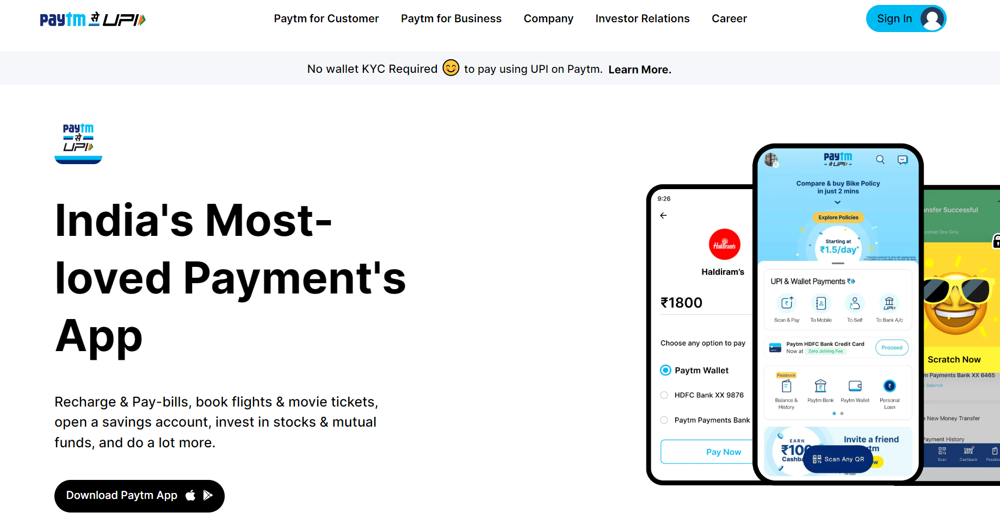

# [Paytm Karo!](paytm-clone-16.netlify.app)

## About Project

I have tried to create a clone of the famous company called paytm. It's clone (not a working clone. i mean, it has no back-end) of the home-page of the Paytm's website.

So, not many people know about this. That Paytm isn't responsive. I have tried to fix this issue using Tail-Wind CSS's responsive classes.

## Time Taken

Around 2 weeks for creating the website for the main screen and for the mobile screens too. As, Using the Tailwind-CSS was a new experience to me.

## Concepts Used

 - flex display property.
 - learned about group hovering classes.
 - Used pre-defined classes tailwind to make it responsive.
 - Basic margin, padding etc.

##  Find Me On

 - [LinkedIn](https://www.linkedin.com/in/varun-g-65282489)
 - [Github](https://github.com/varung735)

## Thank You. 